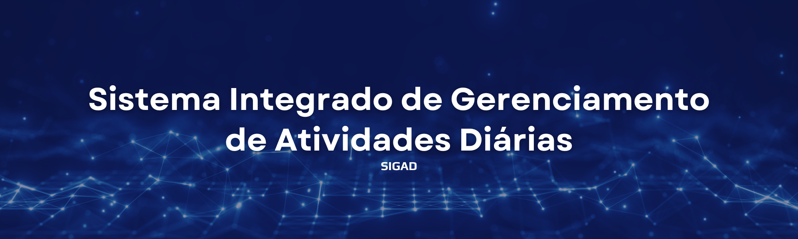
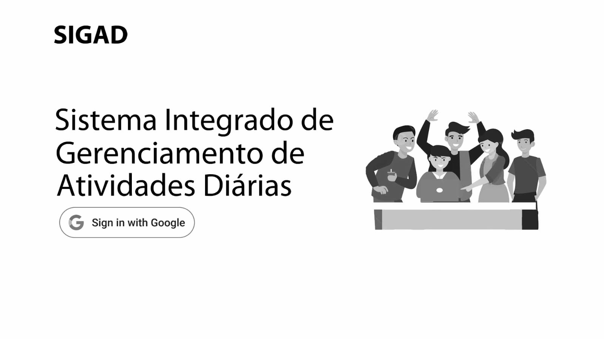
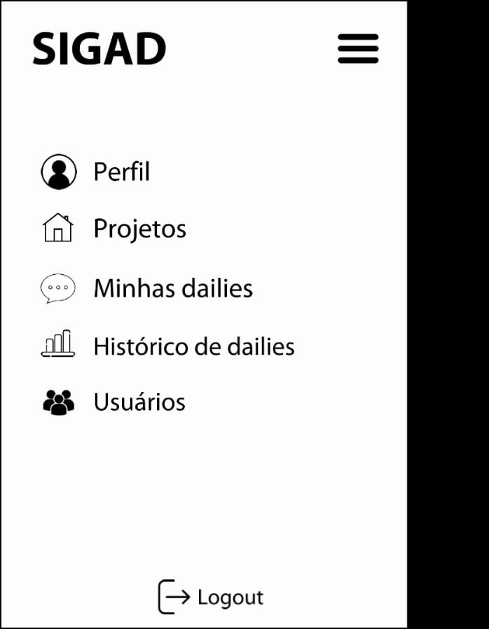
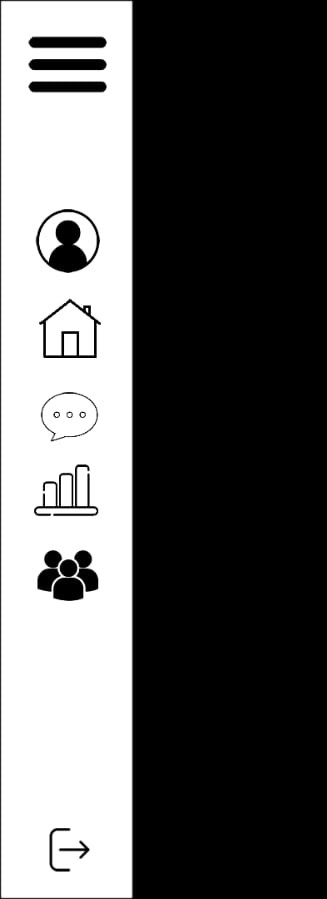
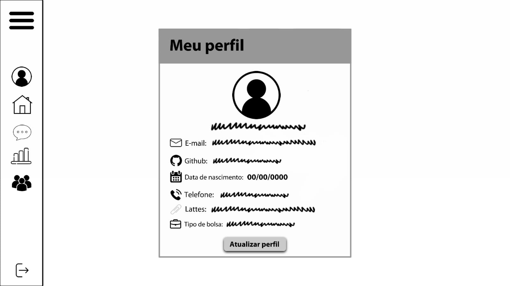
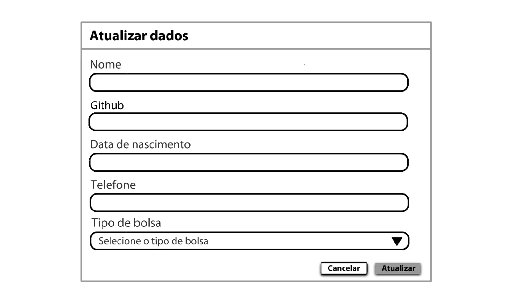
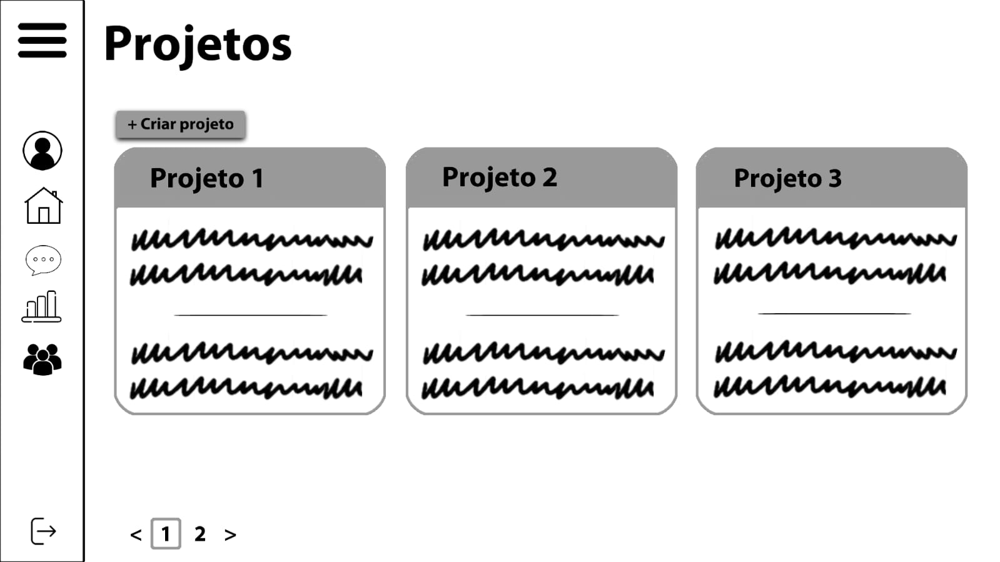
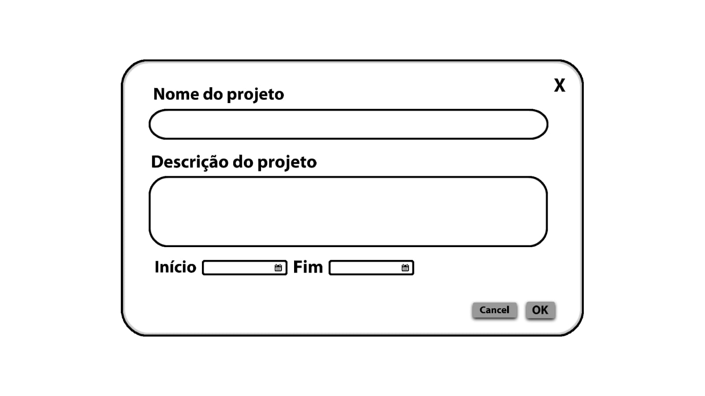
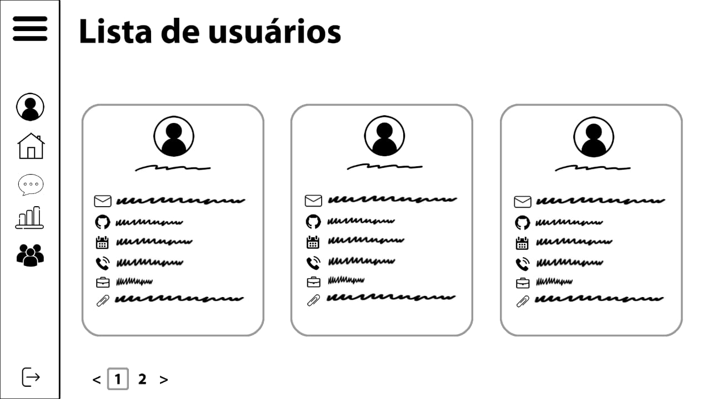

<h1 align="center"> 👩🏻‍💻Sistema Integrado de Gerenciamento de Atividades Diárias - SIGAD ⏳ </h1>

## 📝 **Índice**
- [📝 **Índice**](#-índice)
- [📜 **Apresentação**](#-apresentação)
- [🚀 **Funcionalidades**](#-funcionalidades)
- [🖼️ **Protótipo de Baixa Fidelidade**](#️-protótipo-de-baixa-fidelidade)
  - [Tela de Login](#tela-de-login)
  - [Tela NavBar](#tela-navbar)
  - [Tela de Perfil do Usuário](#tela-de-perfil-do-usuário)
  - [Tela de Gestão de Projetos](#tela-de-gestão-de-projetos)
  - [Tela de Usuários](#tela-de-usuários)
- [🛠️ **Tecnologias Utilizadas**](#️-tecnologias-utilizadas)
- [🔗 **Links do Projeto - Documentações**](#-links-do-projeto---documentações)
- [👥 **Equipe**](#-equipe)

## 📜 **Apresentação**

O SIGAD (Sistema Integrado de Gerenciamento de Atividades Diárias) foi desenvolvido para aprimorar a organização e a produtividade em laboratórios de pesquisa e inovação. Ele permite o armazenamento de informações dos membros, o acompanhamento de atividades e um sistema de dailies em formato de texto, proporcionando maior transparência e eficiência na gestão de tarefas. 

Inspirado no framework SCRUM, o SIGAD substitui as dailies presenciais por um formato escrito, otimizando o tempo das equipes e facilitando a adaptação para diferentes contextos e necessidades.

## 🚀 **Funcionalidades**  
- **Login Seguro:** Autenticação via Google OAuth
- **Gestão de Perfis:** Visualização e edição de informações pessoais
- **Gerenciamento de Projetos:** Criação e acompanhamento de projetos
- **Controle de Dailies:** Registro e histórico detalhado de dailies
- **Filtros Inteligentes:** Pesquisa avançada por datas e usuários

## 🖼️ **Protótipo de Baixa Fidelidade**
### Tela de Login

### Tela NavBar

### Tela de Perfil do Usuário

### Tela de Gestão de Projetos

<!-- ### Tela de Registro de Dailies
 -->

<!-- ### Tela de Histórico de Dailies
 -->

### Tela de Usuários

<!-- ## 📊 **Diagramas e Arquitetura do Sistema**   -->
<!-- - **Diagrama de Casos de Uso:**   -->
<!-- - **Diagrama de Classes:**   -->
<!-- - **Fluxo de Dados:**   -->

## 🛠️ **Tecnologias Utilizadas**
- **Versionamento de Código**: Git, GitHub
- **Front-end**: HTML5, CSS3, React, TypeScript, Vite
- **Back-end**: Python, Flask
- **Banco de Dados:** Postgres
- **Autenticação:** Google OAuth

## 🔗 **Links do Projeto - Documentações**
- [Introdução](https://docs.google.com/document/d/1-xst9zQmlG0L_-pcp2AxOyFK3xuVjmkD/edit?usp=drive_link&ouid=110889014359565880507&rtpof=true&sd=true)
- [Requisitos](https://docs.google.com/document/d/1BhiheJQEZfIPeXJSv3PKWcr3mgpZCcuZ/edit?usp=drive_link&ouid=110889014359565880507&rtpof=true&sd=true)
- [Protótipo](https://docs.google.com/document/d/1DHP6o4-t_KfNZbTsxLzOaIw6JQaypsMYHx1qtScMMyE/edit?usp=drive_link)
- [Diagrama](https://docs.google.com/document/d/1-e4QdUif63tULLjkbsehJhwGNBVFi3kMuEsJr1BUZr0/edit?usp=drive_link)
- [Slides](https://docs.google.com/presentation/d/1Aeb9gTNs04LZh5dtTy-1r37lRPeANzZ7/edit?usp=sharing&ouid=110889014359565880507&rtpof=true&sd=true)

## 👥 **Equipe**
| [   Igor Valente ](https://github.com/igorvalente1004)   <i>Orientador</i> | [   Débora Lima ](https://github.com/deboradls)   <i>Coordenadora, Desenvolvedora e QA</i> | [   Nykollas Souza ](https://github.com/nykoollas)   <i>Designer</i> | [    Jhonny Cunha ](https://github.com/jhonnycs)   <i>Desenvolvedor</i> |
| :-----------------------------------------------------------------------------------------------------------------------------: | :-------------------------------------------------------------------------------------------------------------------------------------------------------------------------------------------------------------------------------------: | :--------------------------------------------------------------------------------------------------------------------------------------------------------------: | :----------------------------------------------------------------------------------------------------------------------------------------------------------------: |